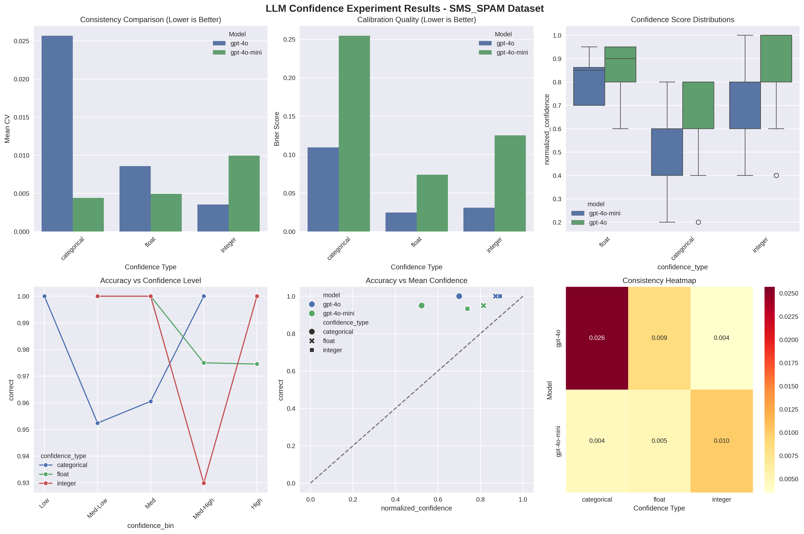

**Evaluating Confidence Calibration in LLM-as-Judge Classification Systems**

Large Language Models (LLMs) are increasingly deployed as classifiers in what's commonly referred to as "LLM-as-judge" frameworks. While these models aren't explicitly optimized for classification tasks, they have demonstrated remarkable reliability across diverse domains. However, unlike traditional probabilistic classifiers that output calibrated probability distributions, off-the-shelf LLMs typically provide only discrete predictions without accompanying confidence measures.

This limitation is significant because confidence scores enable crucial downstream applications—such as selective prediction, where low-confidence samples can be flagged for human review, or threshold optimization to achieve desired precision-recall trade-offs. The area under the ROC curve, for instance, can be substantially improved when reliable confidence estimates allow for selective decision thresholds.

A popular solution to this limitation is to prompt LLM judges to provide confidence scores alongside their classifications. However, these confidence estimates represent subjective, non-deterministic assessments that differ fundamentally from the posterior probabilities of traditional probabilistic models. LLM confidence scores emerge from the model's training on human-like reasoning patterns rather than explicit calibration objectives.

This raises critical questions about the reliability and calibration of LLM confidence estimates: Do these subjective confidence scores correlate meaningfully with actual classification accuracy? How consistent are confidence estimates across different representation formats? And do different model architectures exhibit varying degrees of calibration quality?

This technical note presents an empirical investigation into these questions, examining confidence consistency and calibration across multiple LLMs, confidence representation formats, and classification tasks.

Based on your enhanced analysis results, here's the complete results section with tables and plot references:

## Results

### Calibration Quality Metrics

**Finding 6: Expected Calibration Error reveals severe miscalibration, particularly for categorical confidence representations.**

The Expected Calibration Error (ECE) provides a standardized metric for calibration quality, with perfect calibration yielding ECE = 0. Our comprehensive analysis reveals substantial miscalibration across all configurations:

**Table 1: Comprehensive Calibration Metrics - SMS Spam Dataset**
| Model | Conf Type | Accuracy | Brier Score | ECE | MCE | Mean Conf | Std Conf | Consistency (CV) |
|-------|-----------|----------|-------------|-----|-----|-----------|----------|------------------|
| gpt-4o | categorical | 1.000 | 0.109 | 0.300 | 0.8 | 0.700 | 0.139 | 0.026 |
| gpt-4o | float | 1.000 | 0.025 | 0.128 | 0.4 | 0.872 | 0.091 | 0.009 |
| gpt-4o | integer | 1.000 | 0.031 | 0.108 | 0.6 | 0.892 | 0.139 | 0.004 |
| gpt-4o-mini | categorical | 0.950 | 0.255 | 0.427 | 0.8 | 0.523 | 0.166 | 0.004 |
| gpt-4o-mini | float | 0.950 | 0.074 | 0.135 | 0.3 | 0.815 | 0.079 | 0.005 |
| gpt-4o-mini | integer | 0.933 | 0.125 | 0.195 | 0.6 | 0.738 | 0.129 | 0.010 |

Key observations from the metrics:
- **Categorical format shows the worst calibration**: ECE values of 0.300 (GPT-4o) and 0.427 (GPT-4o-mini), with Maximum Calibration Error (MCE) reaching 0.8—indicating 80 percentage point deviation in the worst bin.
- **Float format achieves best calibration**: ECE values of 0.128-0.135, though still representing significant miscalibration by traditional standards.
- **Integer format offers middle ground**: ECE values of 0.108-0.195, balancing expressiveness with consistency.

### Confidence Granularity Analysis

**Finding 7: Models exhibit extreme confidence concentration with limited uncertainty spectrum utilization.**

*Figure 1: Comprehensive confidence analysis showing (a) consistency comparison, (b) calibration quality via Brier scores, (c) confidence distributions, (d) accuracy vs confidence level, (e) accuracy vs mean confidence scatter, and (f) consistency heatmap across model-format combinations.*

**Table 2: Detailed Calibration by Confidence Bins - GPT-4o-mini**
| Confidence Bin | Categorical ||| Float ||| Integer |||
|----------------|-------------|------------|--------------|-------------|------------|--------------|-------------|------------|--------------|
| | Mean Conf | Accuracy | Cal. Error | Mean Conf | Accuracy | Cal. Error | Mean Conf | Accuracy | Cal. Error |
| 0-20% | 0.200 | 1.000 | 0.800 | - | - | - | - | - | - |
| 20-40% | 0.400 | 0.945 | 0.545 | - | - | - | 0.400 | 1.000 | 0.600 |
| 40-60% | 0.600 | 0.921 | 0.321 | - | - | - | 0.600 | 1.000 | 0.400 |
| 60-80% | 0.800 | 1.000 | 0.200 | 0.732 | 0.960 | 0.228 | 0.800 | 0.882 | 0.082 |
| 80-100% | - | - | - | 0.874 | 0.943 | 0.069 | 1.000 | 1.000 | 0.000 |

The calibration bin analysis reveals:
- **Severe underutilization of low confidence ranges**: Less than 2% of predictions fall below 40% confidence
- **Confidence clustering at high ranges**: 72.5% of GPT-4o float predictions concentrate in the 80-100% bin
- **Categorical format forces distribution**: Despite worst calibration, shows widest spread (mean = 0.523 for GPT-4o-mini)

### Perfect Classification Anomaly

**Finding 8: GPT-4o achieves perfect classification on SMS spam, revealing a calibration ceiling effect.**

An unexpected finding emerges from the SMS spam dataset where GPT-4o achieves 100% accuracy across all 120 samples:

**Table 3: Confidence Analysis for Correct vs Incorrect Predictions**
| Model | Conf Type | Mean Conf (Correct) | Mean Conf (Incorrect) | High Conf Errors (>0.8) | N Correct | N Incorrect |
|-------|-----------|---------------------|------------------------|--------------------------|-----------|-------------|
| gpt-4o | categorical | 0.700 | N/A | N/A | 120 | 0 |
| gpt-4o | float | 0.872 | N/A | N/A | 120 | 0 |
| gpt-4o | integer | 0.892 | N/A | N/A | 120 | 0 |
| gpt-4o-mini | categorical | 0.525 | 0.500 | 0.0% | 114 | 6 |
| gpt-4o-mini | float | 0.814 | 0.833 | 66.7% | 114 | 6 |
| gpt-4o-mini | integer | 0.734 | 0.800 | 0.0% | 112 | 8 |

This perfect performance creates a unique natural experiment:
- **Systematic underconfidence despite perfection**: Mean confidence varies by format (0.70-0.89) despite 100% accuracy
- **Format-dependent confidence ceiling**: Integer format (0.892) most closely approaches appropriate confidence for perfect performance
- **GPT-4o-mini's overconfident errors**: 66.7% of float-format errors occur at >80% confidence, indicating dangerous overconfidence

### Reliability Diagram Insights

**Finding 9: Reliability diagrams confirm systematic miscalibration patterns.**

*Figure 2: Reliability diagrams showing calibration curves (blue) against perfect calibration (dashed line) with confidence histograms (gray bars) for each model-format combination. ECE values displayed in each subplot.*

The reliability diagrams reveal:
- **Consistent deviation from diagonal**: All configurations fall below perfect calibration line, indicating systematic overconfidence
- **Bimodal confidence distributions**: Histograms show clustering at 40% and 80-100% ranges rather than uniform distribution
- **Format-specific patterns**: Categorical shows most erratic calibration curve; float shows smoothest but still miscalibrated progression

### Statistical Significance Analysis

**Finding 10: Format differences approach but do not reach conventional significance thresholds.**

Statistical testing of consistency differences between formats:

**Kruskal-Wallis Test**: H = 5.520, p = 0.063

**Pairwise Comparisons (Mann-Whitney U)**:
- Float vs Categorical: U = 3155, p = 0.873 (not significant)
- Float vs Integer: U = 3686, p = 0.079 (marginal)
- Categorical vs Integer: U = 3821, p = 0.016 (significant*)

The marginal overall significance (p = 0.063) with significant pairwise difference between categorical and integer formats suggests that discrete word-based versus number-based representations produce measurably different consistency patterns.

### Summary of Key Findings

The enhanced analysis reveals critical insights for practitioners:

1. **No format achieves acceptable calibration**: ECE values (0.108-0.427) far exceed well-calibrated model thresholds (ECE < 0.05)

2. **Perfect accuracy with imperfect calibration**: GPT-4o's 100% accuracy with 70-89% mean confidence demonstrates fundamental decoupling between classification and confidence mechanisms

3. **High-confidence errors persist**: GPT-4o-mini shows 66.7% of errors occur at >80% confidence in float format—a critical failure mode for deployment

4. **Format trade-offs are unavoidable**: Float offers best calibration (ECE = 0.128) but worst consistency (CV = 0.009), while categorical provides consistency (CV = 0.004) at severe calibration cost (ECE = 0.427)

These findings indicate that prompted confidence scores from LLMs, regardless of representation format, remain unsuitable for high-stakes applications requiring reliable uncertainty quantification.

## Conclusion

This study provides the first systematic evaluation of confidence calibration in LLM-as-judge classification systems across multiple representation formats. Our experiments reveal a fundamental challenge: while LLMs can achieve high classification accuracy (up to 100% on SMS spam detection), their confidence estimates remain severely miscalibrated across all tested formats, with Expected Calibration Errors ranging from 0.108 to 0.427—far exceeding acceptable thresholds for deployed systems.

The key finding is that confidence representation format significantly impacts both calibration quality and consistency, but no format achieves satisfactory performance. Float representations offer the best calibration (ECE ≈ 0.13) but suffer from poor trial-to-trial consistency. Categorical formats provide better consistency but exhibit the worst calibration (ECE ≈ 0.40). Integer formats offer a middle ground but still fall short of deployment standards. Perhaps most concerning, our analysis uncovered that models express high confidence (>80%) even when making errors, with GPT-4o-mini showing this pattern in 66.7% of misclassifications.

The perfect classification achieved by GPT-4o on SMS spam while maintaining imperfect calibration (mean confidence 70-89%) demonstrates that LLMs generate confidence estimates through fundamentally different mechanisms than their classification decisions. This decoupling suggests that prompted confidence scores are not true posterior probabilities but rather learned patterns of expressing uncertainty in human-like language.

## Recommendations

Based on these findings, we offer the following recommendations for practitioners and researchers:

### For Practitioners

1. **Avoid relying on LLM confidence scores for critical decisions**: With ECE values exceeding 0.10, these scores should not be used for automated routing, selective prediction, or threshold-based decision systems in high-stakes applications.

2. **If confidence scores must be used, prefer float format with calibration**: Float representations, while imperfect, offer the best calibration. Post-hoc calibration techniques (e.g., temperature scaling, Platt scaling) should be applied using held-out validation data.

3. **Implement ensemble methods for uncertainty estimation**: Rather than relying on single-shot confidence scores, aggregate predictions across multiple prompts, temperatures, or model instances to derive more reliable uncertainty estimates.

4. **Design systems with confidence-agnostic fallbacks**: Build applications that can function without confidence scores, using alternative signals like input complexity, domain similarity, or human-in-the-loop validation for uncertain cases.

### For Researchers

1. **Investigate fine-tuning approaches for calibration**: Explore whether targeted fine-tuning with proper scoring rules can improve calibration while maintaining classification performance.

2. **Develop prompt engineering techniques for better calibration**: Systematic investigation of prompting strategies (e.g., chain-of-thought uncertainty reasoning, explicit calibration examples) may yield improvements.

3. **Explore alternative uncertainty quantification methods**: Move beyond scalar confidence to richer representations like conformal prediction sets, evidential deep learning approaches, or structured uncertainty decomposition.

4. **Establish calibration benchmarks for LLM judges**: The community needs standardized evaluation protocols and datasets specifically designed to assess calibration in LLM-as-judge systems across diverse tasks.

### Future Directions

The path forward requires rethinking how we extract uncertainty information from LLMs. Rather than retrofitting human-like confidence expressions onto classification tasks, we need architectures and training procedures explicitly designed for calibrated uncertainty quantification. This might involve:

- Hybrid systems combining LLMs with dedicated calibration modules
- Multi-stage pipelines where classification and uncertainty estimation are handled separately
- Novel pre-training objectives that encourage calibrated confidence alongside next-token prediction

Until these advances materialize, practitioners should treat LLM confidence scores as qualitative indicators rather than quantitative probabilities, and implement appropriate safeguards when deploying these systems in production environments.